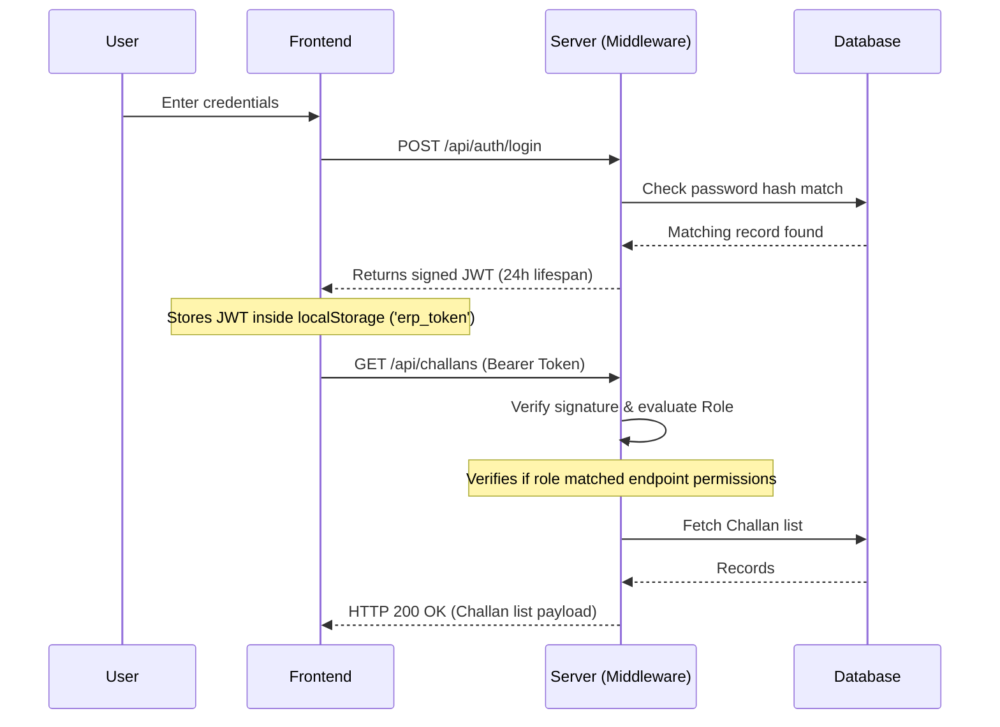

# System Architecture Documentation

This document describes the design and structural architecture of the **Fundsroom Mini ERP & CRM Operations Portal**.

---

## 🏛️ Overall Architectural Blueprint

The application employs a decoupled **Client-Server Architecture** utilizing a React Single-Page Application (SPA) for the frontend interacting with a Node.js REST API backend connected to a MySQL relational database.

```mermaid
flowchart TD
    subgraph Client-Side (React SPA)
        UI[React Components / Page Views]
        AuthC[Auth Context / Session state]
        API_C[API Client Service Layer]
    end

    subgraph Server-Side (NodeJS/Express/PRISMA)
        Middleware[Auth & RBAC Middleware]
        Controllers[API Controllers / Route Handlers]
        Prisma[Prisma Client Mapping Layer]
    end

    Database[(MySQL Instance)]

    UI --> API_C
    API_C --> Middleware
    Middleware --> Controllers
    Controllers --> Prisma
    Prisma --> Database
    AuthC --> UI
```

---

## 📂 Backend Structural Layout

The backend is built with **Express** and **TypeScript** adhering to a controller-router structure with declarative schemas:

*   **Server Entry (`src/server.ts`)**: Binds Express server, configures CORS, activates global middleware (Helmet, JSON parsers), and starts port listener.
*   **Application Boot (`src/app.ts`)**: Integrates routes and handles error boundaries.
*   **Routing Layer (`src/routes/`)**: Declares REST paths and registers role-based access control (RBAC) rules.
*   **Controller Layer (`src/controllers/`)**: Encapsulates incoming query sanitization, business validation (via Zod), database calls, and response serialization.
*   **Auth Middleware (`src/middleware/auth.ts`)**: Validates Bearer headers and executes JWT decryption.

---

## 🎨 Frontend View Navigation Architecture

The frontend is a **Vite-based React** build configured with:

*   **Private/Public Routing**: Gated routes managed via custom paths checking roles stored in `AuthContext` to prevent unauthorized client rendering.
*   **Context API State**: Local token caching to track active sessions across browser updates.
*   **Dynamic Data Fetching**: View triggers (`useEffect` hooks) calling asynchronous HTTP services (`api.js`) mapping responses straight to local layouts.

---

## 🔒 Session Security & JWT Verification Flow

Authenticating a user generates a stateless JSON Web Token (JWT) containing basic user attributes and security claims.


