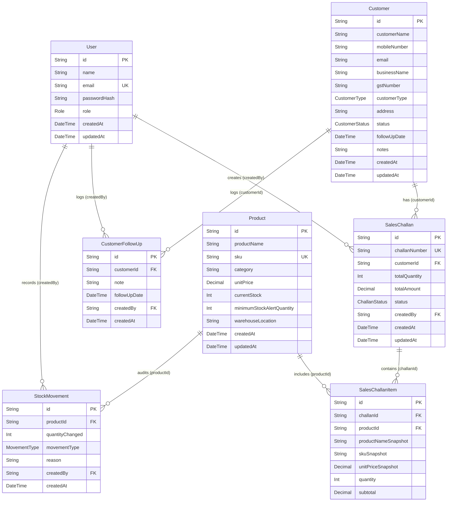

# Database Design Documentation

This document describes the schema design, tables, models, and data types built into the **MySQL Database** mapping via **Prisma ORM**.

---

## 📊 Entity Relationship Diagram

---

## 🗄️ Model Schema Definitions

### 1. `User` Model
Represents employees and managers accessing the ERP system.
*   `id` (String, Primary Key, UUID): Unique user identifier.
*   `name` (String): Display name of the user.
*   `email` (String, Unique Index): Log in username.
*   `passwordHash` (String): Securely salt-bcrypt password digest.
*   `role` (Enum `Role`): Authorization group (`Admin`, `Sales`, `Warehouse`, `Accounts`).

### 2. `Customer` Model
Represents leads, prospects, and established business buyers.
*   `id` (String, Primary Key, UUID): Unique customer identifier.
*   `customerName` (String, Index): Name of contact person.
*   `mobileNumber` (String, Index): Contact mobile key.
*   `email` (String): Contact email.
*   `businessName` (String): Registered brand or business entity.
*   `gstNumber` (String, Optional): Tax key.
*   `customerType` (Enum `CustomerType`): Account type (`Retail`, `Wholesale`, `Distributor`).
*   `status` (Enum `CustomerStatus`): Active lifecycle state (`Lead`, `Active`, `Inactive`).
*   `followUpDate` (DateTime, Optional): Date set for follow-up reminders.
*   `notes` (String, Text): Detailed background notes.

### 3. `CustomerFollowUp` Model
Tracks consecutive interaction follow-ups with customers.
*   `customerId` (String, Foreign Key -> `Customer.id`, Cascade Delete): Target buyer.
*   `note` (String, Text): Summary of the interaction.
*   `followUpDate` (DateTime): Next planned interaction.
*   `createdBy` (String, Foreign Key -> `User.id`): Employee registering log.

### 4. `Product` Model
Represents items in your warehouse inventory.
*   `id` (String, Primary Key, UUID): Unique item identifier.
*   `productName` (String): Display name of catalog item.
*   `sku` (String, Unique Index): Stock Keeping Unit string.
*   `category` (String, Index): Group category (e.g. "Groceries", "Household").
*   `unitPrice` (Decimal): Reference cost per unit.
*   `currentStock` (Int): Active quantities in the warehouse.
*   `minimumStockAlertQuantity` (Int): Reorder threshold trigger.
*   `warehouseLocation` (String): Placement designation (e.g. "Aisle 4, Shelf 2").

### 5. `StockMovement` Model
Logs double-entry ledger audits for inventory movements.
*   `productId` (String, Foreign Key -> `Product.id`, Cascade Delete): Target stock.
*   `quantityChanged` (Int): Magnitude of change.
*   `movementType` (Enum `MovementType`): Direction (`IN`, `OUT`).
*   `reason` (String): Auditable explanation.
*   `createdBy` (String, Foreign Key -> `User.id`): Creator ID.

### 6. `SalesChallan` Model
Represent sales pipeline orders.
*   `challanNumber` (String, Unique Index): Sequential billing format `CH-YYYY-XXXX`.
*   `customerId` (String, Foreign Key -> `Customer.id`): Buyer references.
*   `status` (Enum `ChallanStatus`): Dispatch state (`Draft`, `Confirmed`, `Cancelled`).
*   `totalQuantity` (Int): Absolute quantity sum of items.
*   `totalAmount` (Decimal): Aggregate billing value.

### 7. `SalesChallanItem` Model
Logs snapshot items included in challan files.
*   `challanId` (String, Foreign Key -> `SalesChallan.id`, Cascade Delete).
*   `productId` (String, Foreign Key -> `Product.id`).
*   `productNameSnapshot` (String): Captures item name at billing generation time to avoid historical drift.
*   `unitPriceSnapshot` (Decimal): Captures item catalog cost at billing.
*   `quantity` (Int): Amount of items ordered.
*   `subtotal` (Decimal): Computed snapshot value (`quantity * unitPriceSnapshot`).
